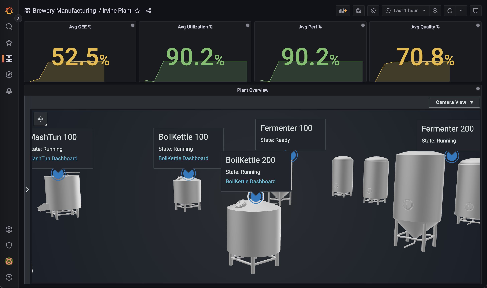
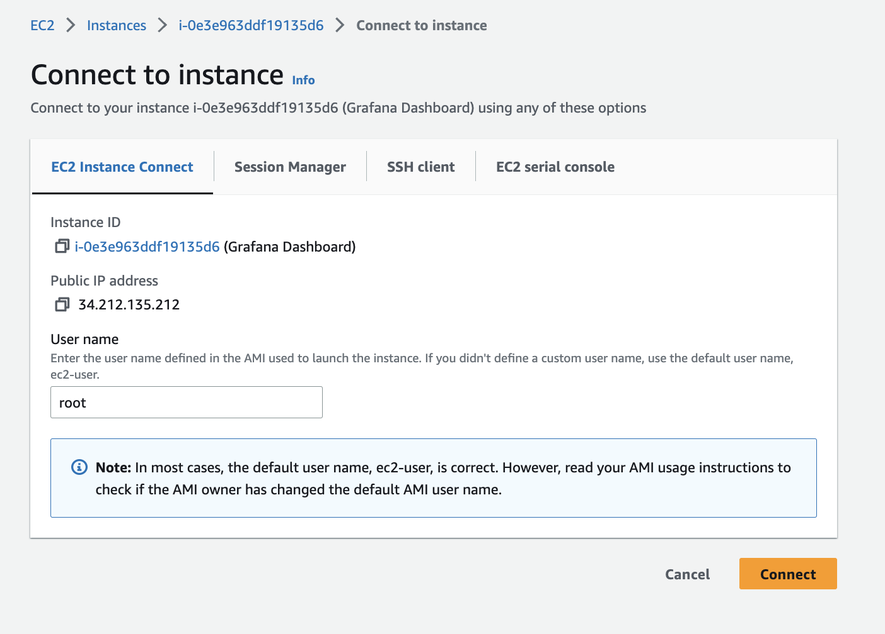

# Guidance for Industrial Digital Twin on AWS

This Guidance provides a set of artifacts that will guide customers in building a production monitoring architecture with AWS IoT TwinMaker and supporting services. The artifacts in this Guidance provide sample demo projects, data simulators, and articles that offer support for using various feature sets within AWS IoT TwinMaker and AWS IoT SiteWise. With AWS IoT TwinMaker, customers can get a 3D model of their plant operations derived from computer-aided design (CAD) or reality capture models, such as Matterport. Using AWS IoT TwinMaker’s Knowledge Graph, customers can view relationships between industrial assets and operations.

The sample demo project in this repository is called the Brewery Manufacturing demo. It provides guidance on how to build a Production Monitoring solution in an Industrial setting where Plant Managers or Line Supervisors can have visibility to plant operations, alerts, and situational awareness to downtime in a 3D visualization. Operations can monitor and diagnose alarms in a 3D visualization that helps reduce the mean time to repair (MTTR) by enabling teams to quickly see potential causes from upstream or downstream operations in a manufacturing process. This reduction in time will improve customer’s ROI by reducing downtime in operations and optimizing the output of product manufactured. 

## Table of Content

1. [Overview](#guidance-for-industrial-digital-twin-on-aws)
    - [Cost](#cost)
2. [Prerequisites](#prerequisites)
    - [Operating System](#operating-system)
3. [Deployment Steps](#deployment-steps)
4. [Deployment Validation](#deployment-validation)
5. [Running the Guidance](#running-the-guidance)
6. [Next Steps](#next-steps)
7. [Cleanup](#cleanup)
8. [Revisions](#revisions)
9. [Notices](#notices)

## Overview (required)

1. Provide a brief overview explaining the what, why, or how of your Guidance. You can answer any one of the following to help you write this:

    - **Why did you build this Guidance?**
    - **What problem does this Guidance solve?**

2. Include the architecture diagram image, as well as the steps explaining the high-level overview and flow of the architecture. 
    - To add a screenshot, create an ‘assets/images’ folder in your repository and upload your screenshot to it. Then, using the relative file path, add it to your README. 

### Cost

You are responsible for the cost of the AWS services used while running this Guidance. As of November 2023, excluding free tiers, the cost for running this Guidance with the default settings in the US East (N. Virginia) is approximately $450 per month for data simulation, storage, computations, retrieval, and visualization. The cost may vary on usage and with the increase of data stored over time.

A large majority of this cost is in AWS IoT SiteWise. Modifying the amount of assets in simulation and frequency of which data is streamed can reduce this cost.

## Prerequisites

### Operating System

- The operating system used for data simulation and the hosting of a Self Managed Grafana instance is Amazon Linux 2. This is deployewd for you in the CloudFormation template. Deployment to other operating systems may require additional steps.

### Third-party tools

- Grafana. This is deployed for you in steps below.

### AWS account requirements

This deployment requires access to the following resources:

**Example resources:**
- EC2
- Systems Manager
- IoT SiteWise
- IoT TwinMaker
- S3 Buckets
- IAM roles with specific permissions
- Access to a Region that suppors this deployment [Default: US East (N. Virginia)]

### Service limits

If there is an increase on the number of IoT SiteWise Assets, Models, and/or transactions per second, make sure that the appropriate limits are extended to support both IoT SiteWise and synchronized service, IoT TwinMaker.

### Supported Regions

This guidance supports the following regions:
- US East (N. Virginia) - Default
- Asia Pacific (Tokyo)
- Asia Pacific (Seoul)
- Asia Pacific (Mumbai)
- AWS GovCloud (US-West)
- Asia Pacific (Singapore)
- Asia Pacific (Sydney)
- Europe (Frankfurt)
- Europe (Ireland)
- US West (Oregon)

## Deployment Steps 

### Demo Description

This demo uses the Brewery SiteWise Simulator to build an Industrial Digital Twin in AWS IoT TwinMaker.

The diagram below is a view of the brewery material flow for the Irvine plant. The Brewery simulates production and consumption of items through the process below. This includes good production, scrap, and simulation of various utilization states. Telemetry data is also generated at the various operations for sensors like temperature, levels, and valve states. With the data produced by this simulation, metrics are calculated in the SiteWise Models for OEE (Utilization, Performance, and Quality).

An IoT TwinMaker Workspace is created and synchronized with the SiteWise models and assets. A set of Grafana dashboards and IoT TwinMaker scenes have been created that enables you to navigate across different equipment within the Irvine Plant to monitor performance metrics.


### Demo Screenshots

#### Irvine Plant - Overview
This high level plant view shows all the equipment in this simulated environment. Clicking on each Scene Tag will display the average KPI metrics (OEE, Performance, Quality, Utilization) for the time range of the dashboard. There is a data overlay on several assets that displays the latest State of the machine and a link to drill down into the dashboard for that asset.



#### Asset Dashboards
As you drill down into an asset, such as the MashTun below, you will be presented with several types of data for that asset. This includes telemetry data, KPIs, and production order data such as lots, items, and utilization reasons. In addition, alerts have been configured in Grafana for the OEE (Overall Equipment Effectiveness) when it drops below 50%. Clicking on each Scene Tag will trend various properties on the right time-series trends.


### 1. Steps

The deployment of the demo is spread out over several cloudformation stacks. The first two stacks will deploy the data simulator and the rest will deploy the IoT TwinMaker Workspace, Grafana Dashboard server, and Dashboard role. Here is an architecture of the complete brewery demo environment:


#### 1.1 Deploy Brewery SiteWise Simulator

1. Install the [Brewery SiteWise Simulator](https://github.com/aws-solutions-library-samples/breweries-sitewise-simulator) following the Quick Deploy steps.

#### 1.2 Deploy IoT TwinMaker Workspace

1. Open this <a href="cf/BreweryWorkspace.json?raw=1" target="_blank" download>cloudformation</a> template and click "File->Save As" in your browser to download. This template deploys the IoT TwinMaker Workspace and Synchronize it with the SiteWise Assets created in step 1.
2. Go to CloudFormation in your console and click `Create Stack`.
3. Upload the template file your downloaded and proceed through the steps to deploy.
4. Wait until the stack is completed successfully. 

#### 1.3a Deploy Grafana Dashboard Server (Automated)

1. Open this <a href="cf/GrafanaDashboardServer.json?raw=1" target="_blank" download>cloudformation</a> template and click "File->Save As" in your browser to download. This template deploys a self managed Grafana Dashboard server, IAM Role, IoT TwinMaker scenes, and preloaded dashboards for the Brewery demo.
2. Go to CloudFormation in your console and click `Create Stack`.
3. Upload the template file your downloaded and proceed through the steps to deploy.
4. Wait until the stack is completed successfully. 
> **_NOTE:_**  If this step fails, your EC2 instance may be receiving a forced reboot signal from Systems Manager for a patch before the script in user-data completes. Delete this failed stack and proceed to [step 1.3b](#13b-deploy-grafana-dashboard-server-manual) for a manual install.
5. The Grafana URL is found in the Outputs tab of the Cloudformation template.
6. Open the Grafana portal. The default credential is **admin/admin**. Change this once you login.
7. Go browse for the dashboards. The simulation will take several minutes to produce items and get processed downstream.

#### 1.3b Deploy Grafana Dashboard Server (Manual)

1. Open this <a href="cf/GrafanaDashboardServer_NoInstall.json?raw=1" target="_blank" download>cloudformation</a> template and click "File->Save As" in your browser to download. This template deploys a self managed Grafana Dashboard server and IAM Role. We will manually install the IoT TwinMaker scenes and preloaded dashboards for the Brewery demo.
2. Go to CloudFormation in your console and click `Create Stack`.
3. Upload the template file your downloaded and proceed through the steps to deploy.
4. Wait until the stack is completed successfully.
5. Proceed to the EC2 Console and connect to the instance.

6. Click on the tab `EC2 Instance Connect`, change the user name to `root`, and click `Connect`

7. Once logged into the session, run this script and wait for it to complete. You can ignore errors like this "ERROR:root:('Roaster200', 'null')"

``` bash
yum install -y git
git clone https://github.com/aws-solutions-library-samples/guidance-for-industrial-digital-twin-on-aws.git                             
cd guidance-for-industrial-digital-twin-on-aws/scripts/
sh install.sh

```
8. The Grafana URL is shown at the end of the installation and is found in the Outputs tab of the Cloudformation template.
9. Open the Grafana portal. The default credential is **admin/admin**. Change this once you login.
10. Go browse for the dashboards. The simulation will take several minutes to produce items and get processed downstream.

### Deployment Validation

* Open CloudFormation console and verify the successfull deployment of each template.
* Open the Grafana portal. Verity the simulation is working when you start to see values and trends in the dashboards.


## Running the Guidance

This guidance solution will run indefintely producing simulated data. If you are not using, be sure to perform a cleanup to stop billing. To access the system, just open the Grafana portal as instructed in the steps above.


## Next Steps (required)

This guidance provides a base framework from which you can build on top for your Industrial Solution. With this guidance, you can modify certain aspects of this system to be tailored to your environment. This may include the following:
- Customization to data ingestion with services like AWS IoT Greengrass, AWS IoT SiteWise, and data ingestion AWS partners.
- Import of your own 3D models or Matterport integration with AWS IoT TwinMaker
- Custom IoT TwinMaker scenes and dashboards for your environment
- Additional data sources for IoT TwinMaker beyond the use of IoT SiteWise


## Cleanup

To clean up, delete the following stacks in this order:
- Grafana Dashboard Server
- IAM Role for Grafana (Stack created by the Grafana Dashboard server)
- IoT TwinMaker Workspace (Make sure to delete the Scenes and Resources first in the IoT TwinMaker Console)
- Simulation server
- SiteWise Assets

## Revisions

- First release

## Notices

*Customers are responsible for making their own independent assessment of the information in this Guidance. This Guidance: (a) is for informational purposes only, (b) represents AWS current product offerings and practices, which are subject to change without notice, and (c) does not create any commitments or assurances from AWS and its affiliates, suppliers or licensors. AWS products or services are provided “as is” without warranties, representations, or conditions of any kind, whether express or implied. AWS responsibilities and liabilities to its customers are controlled by AWS agreements, and this Guidance is not part of, nor does it modify, any agreement between AWS and its customers.*
